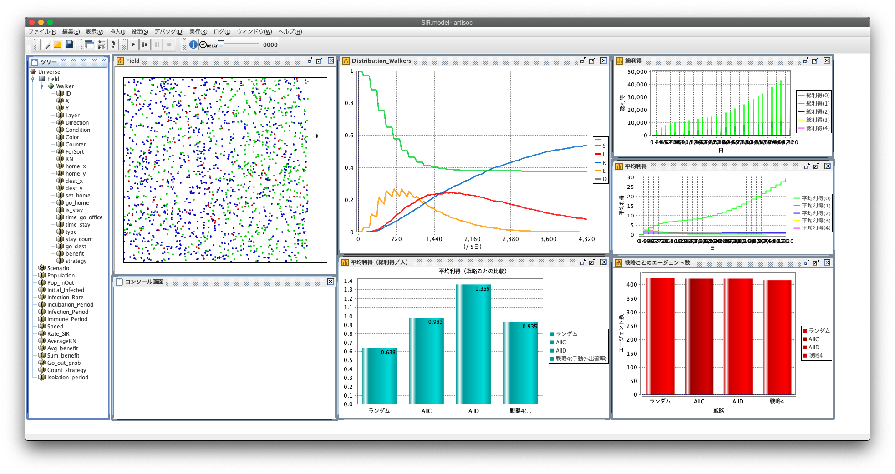

# COVID-19のSIRモデルによる感染シミュレーション+α の提案
- 琉球大学大学院 理工学研究科 情報工学専攻 の 2020後期の講義『複雑系工学論』の課題。
  - コロナ19に関するシミュレーション。
  - コロナ19に関連したテーマを決めて、シミュレーションを行う。

## idea
- テーマ
  - COVID-19(SEIR)自粛環境下における、囚人のジレンマ拡張モデルを用いた外出戦略の検討
- 目標
  - 囚人のジレンマ ゲームを組み込むことで、コロナ自粛における、
    - 「利得」を加味したシミュレーション
    - 「優秀な戦略」の推定
    を目指す。 
- ベース モデル
  - [ウイルス感染症のパンデミックシミュレーション](http://int-info.com/index.php/pandemic/)
  - [【Artisoc公式】SIRモデル](https://mas.kke.co.jp/model/trend_model/)
  - [【Artisoc公式】囚人のジレンマモデル](https://mas.kke.co.jp/model/prisoner/)
- 追加
  - 囚人のジレンマ ゲーム
  - 

## 設計
### 説明変数
#### 1. 戦略
追記予定

#### 2. 利得表
追記予定

### 目的変数、観測対象
- SEIRD それぞれの「数の推移」（および「最大値」）
- 戦略ごとの「平均利得」

## 結論
- AllD（毎日外出）が、最も「平均利得」が高かった。

## 私の考え
- コロナ自粛環境下における「戦略」や「利得表」の設計はとても難しい。
  - カオス（バタフライ効果のある）変数が多い。
  - 国や文化、政治などから、個人の思想・感情まで、影響が大きいパラメータが多種多様である。
  - それらの変数が、とても複雑に絡み合っている。
- 関係のある変数やバイアスを全て洗い出すことが現実的に困難なため、AllD が最も優秀な戦略であると結論付けることはできない。

## プロダクトバックログ
- [Trello](https://trello.com/b/5bQLXGc3/「複雑系工学論」)
